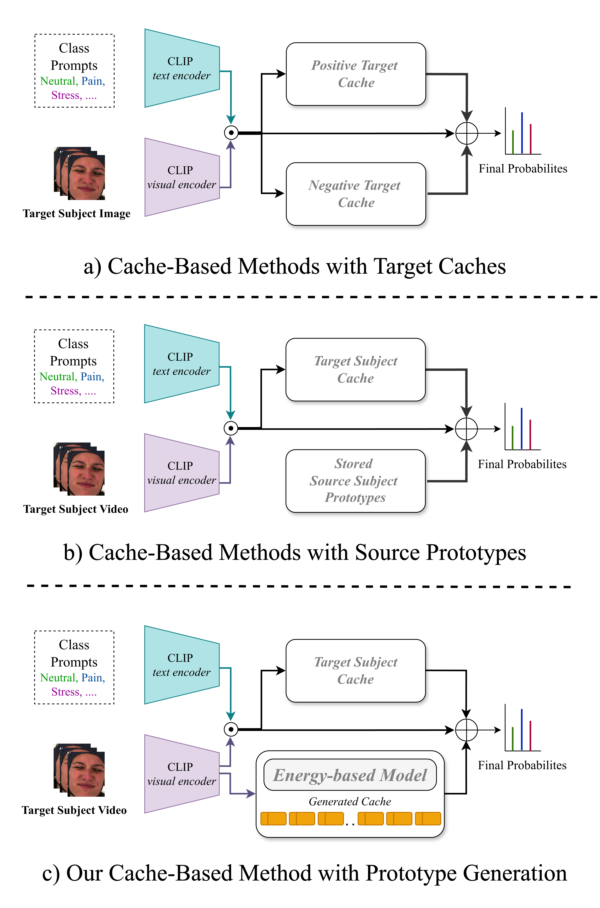
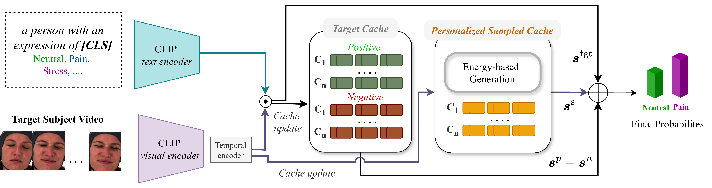

# Test-Time Adaptation with Online Personalized Energy-Based Cache for Fine-Grained Video Expression Recognition

by
**Masoumeh Sharafi<sup>1</sup>,
Soufiane Belharbi<sup>1</sup>,
Muhammad Osama Zeeshan<sup>1</sup>,
Houssem Ben Salem<sup>1</sup>,
Ali Etemad<sup>5</sup>,
Alessandro Lameiras Koerich<sup>2</sup>,
Marco Pedersoli<sup>1</sup>,
Simon Bacon<sup>3,4</sup>,
Eric Granger<sup>1</sup>**

<sup>1</sup> LIVIA, Dept. of Systems Engineering, ÉTS, Montreal, Canada
<br/>
<sup>2</sup> LIVIA, Dept. of Software and IT Engineering, ÉTS, Montreal, Canada
<br/>
<sup>4</sup> Dept. of Health, Kinesiology \& Applied Physiology, Concordia University, Montreal, Canada
<br/>
<sup>5</sup> Montreal Behavioural Medicine Centre, Montreal, Canada
<br/>
<sup>3</sup> Dept. of Electrical and Computer Engineering, Queen’s University, Kingston, Canada

<p align="center">
<p align="center">


## Abstract
Facial expression recognition (FER) in videos remains challenging because models must identify subtle temporally evolving affective states that vary significantly across target individuals. Although vision-language models provide transferable visual-semantic representations, models trained on subject-independent source data often degrade under subject-specific distribution shifts at inference time. State-of-the-art test-time adaptation (TTA) methods typically optimize models during inference, increasing computational cost and latency. Cache-based approaches avoid parameter updates but typically require accumulating sufficient target samples to construct reliable class prototypes. This is difficult at the beginning of adaptation and when some classes are rarely observed. To alleviate these limitations, existing methods may store source prototypes, but these are not personalized to the current target subject. This paper introduces Energy-Based Cache Personalization (EB-CaP), a subject-based online TTA method for video FER that samples class-specific prototypes personalized to each target video on-the-fly. Unlike existing cache-based methods, \ours does not require observing and accumulating large amounts of target data or storing diverse source prototypes across subjects. Instead, it relies on a lightweight energy-based model (EBM) to sample class-wise prototypes from the current unlabeled video and populate a personalized cache online. The energy function relies only on the pretrained CLIP model, where the similarity between the visual embedding of the target video and the class text embeddings guides the energy-based sampling process. In parallel, positive and negative caches store reliable and uncertain target embeddings, respectively. An adaptive entropy gating follows the evolving confidence distribution to control cache updates, while a diversity gate prevents redundant samples from dominating the memory. Predictions are refined by combining cache-derived scores with the current CLIP scores.
Experiments on 3 challenging video datasets for video FER - BioVid, StressID, and BAH- indicate that EB-CaP can outperform state-of-the-art TTA methods, while maintaining low computational and memory overhead.
## Installation

Install dependencies:

```bash
pip install -r requirements.txt
```

## Datasets
```sh
Biovid: https://www.nit.ovgu.de/BioVid.html#PubACII17
StressID: https://project.inria.fr/stressid/
BAH: https://www.crhscm.ca/redcap/surveys/?s=LDMDDJR3AT9P37JY
Aff-Wild2: https://sites.google.com/view/dimitrioskollias/databases/aff-wild2
```

## Online TTA
```sh
bash ./scripts/run_online_tta.sh
```
